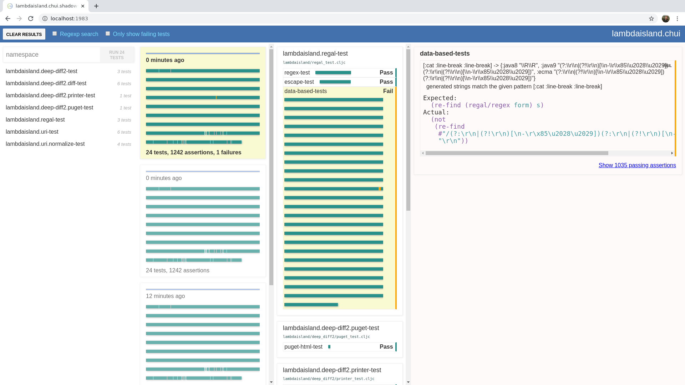

# chui

<!-- badges -->
[](https://circleci.com/gh/lambdaisland/chui) [](https://cljdoc.org/d/lambdaisland/chui) [](https://clojars.org/lambdaisland/chui)
<!-- /badges -->

Modern ClojureScript test runner



## 錘 (锤) [chuí]

(rhymes with "hey")

- hammer
- to hammer into shape
- weight (e.g. of a steelyard or balance)

See the [Line Dict entry](https://dict.naver.com/linedict/zhendict/dict.html#/cnen/entry/cf6a566ba4a64496b8d8610525f3d9e8) for an audio sample.

### Funded by Pitch

We want to thank [Pitch](https://pitch.com) for funding the initial development
of Chui, and their continuing support of the Clojure and ClojureScript
ecosystem.

<!-- opencollective -->
### Support Lambda Island Open Source

Chui is part of a growing collection of quality Clojure libraries and
tools released on the Lambda Island label. If you find value in our work please
consider [becoming a backer on Open Collective](http://opencollective.com/lambda-island#section-contribute)
<!--/opencollective -->

## Motivation

The testing library that comes with ClojureScript, `cljs.test`, consists of two
parts: an API for expressing tests and assertions, and a test runner for
executing tests. Chui re-implements the test runner part in a way that allows
more dynamic and fine-grained control, so that it forms a better base for
tooling. It also offers an attractive browser-based UI for running tests and
inspecting results.

See the [Architecture Decision Log](doc/architecture_decision_log.org) for
technical background.

## Installation

deps.edn

``` clojure
lambdaisland/chui {:mvn/version "0.0.106"}
```

project.clj

``` clojure
[lambdaisland/chui "0.0.106"]
```


## Quickstart with shadow-cljs

The easiest way to use this right now is with Shadow-cljs's `:browser-test` target.

Use the `lambdaisland.chui.shadowrun` namespace as you `:runner-ns`, and you
should be good to go.

``` clojure
{:dev-http
 {8888 "classpath:public"}

 :builds
 {:test
  {:target     :browser-test
   :runner-ns  lambdaisland.chui.shadowrun
   :test-dir   "resources/public"
   :asset-path "/ui"
   :ns-regexp  "-test$"}}}
```

This assumes that you are using the `index.html` generated by Shadow. If you're
serving your own `index.html` then make sure it contains a call to
`lambdaisland.chui.shadowrun/init`.

## Use with other tools

The main reason we recommend shadow-cljs's `:browser-test` is that it will find
test namespaces on the filesystem, and automatically add them to your build as
dependencies of the test runner namespace. When using other tools you have to do
that manually, as so far no other tools have this functionality, but we hope
something like this will become more widely available, either in ClojureScript
itself, or in common tools.

Here's what a main namespace that starts Chui and runs your tests looks like.

``` clojure
(ns my.test.runner
  (:require [goog.dom :as gdom]
            [lambdaisland.chui.runner :as runner]
            [lambdaisland.chui.ui :as ui]
            [lambdaisland.chui.test-data :as test-data]

            ;; Add all your test namespaces as dependencies, to make sure they
            ;; are part of the build, and that they are compiled *before* this
            ;; namespace gets compiled. This is imporant for chui to find your
            ;; tests.
            my.foo-test
            my.bar-test
            my.baz-test))

;; This is a macro that inspects the cljs compiler environment to find
;; information about which tests there are, and then injects this information
;; into the build so that it's available to Chui.
(test-data/capture-test-data!)

(defn start
  "Start a test run, this is the same as pressing the Test button in the UI. You
  can run this after hot-reloading code."
  []
  (js/window.requestIdleCallback
   #(ui/run-tests)))

(defn stop
  "Interrupt the current test run, calls the done callback when done. Can be used
  as a pre-hook before hot code reloading."
  [done]
  (runner/terminate! done))

(defn ^:export init
  "Mount the Chui UI and kick off a test run, call this upon first page load."
  []
  (let [app (gdom/createElement "div")]
    (gdom/setProperties app #js {:id "chui-container"})
    (gdom/append js/document.body app))
  (ui/render! (.getElementById js/document "chui-container"))
  (start))
```

## Usage instructions

The Chui UI has four columns. The first one contains a list of all your tests
namespaces, as well as a search box and a test button.

The button kicks off a test run, by default it runs all tests, but you can
narrow that down by either selecting tests manually in the list, or by putting a
query in the search box. By default this does a simple string search, but you
can use the "regexp" checkbox in the top bar to treat the input as a regex
pattern.

The second column from the left contains a history of all your test runs. For
each run you see a regular progress bar, and below that a visual overview of the
test run, as a green/orange/red bar split across multiple lines.

You can think of this bar as being similar to the output you get in
terminal-based test runners:

```
.........E.......FFF...........
```

Each bit of the bar represents a single assertion, colored green if the
assertion passes, orange if it fails, and red if it threw an error. The bar is
subdivided in namespaces and test vars. You can hover over each bit to see which
namespace/var it refers to.

Below this visualization you get a summary, number of tests, assertions,
failures and errors.

The third column shows you more details for the selected test run. By default
the latest test run gets selected, but you can select older ones if you want to
inspect previous results.

This third column shows namespaces and test vars. Note that if you have a lot of
tests this can become hard to navigate, this is why you can enable the checkbox
to only show failing tests.

Finally the fourth column shows the individual assertions, with full details.
Which assertions are visible depends on the selection in the third column. By
default all failing tests get selected.

### Limitations

Fixtures must use the `:before` / `:after` syntax. We don't support synchronous
fixtures.

### Promise-based async tests

Chui is able to detect that a `deftest` returns a JavaScript promise, and treat
that as indicating it is an asynchronous test, so that Chui waits for the
promise to resolve.

In vanilla `cljs.test` you would `cljs.test/async` for such tests, but this is a
useful extension for people already relying on promises in their code.

Because this is a non-compatible extension this behavior is opt-in. To turn it
on, add this to your ClojureScript compiler options:

``` clojure
{
 :closure-defines {lambdaisland.chui.runner.PROMISE_ASYNC_TEST true}

 }
```

## License

Copyright &copy; 2020 Arne Brasseur and Contributors

Licensed under the term of the Eclipse Public License 1.0, see LICENSE.
